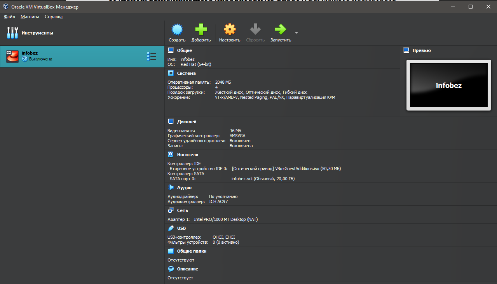
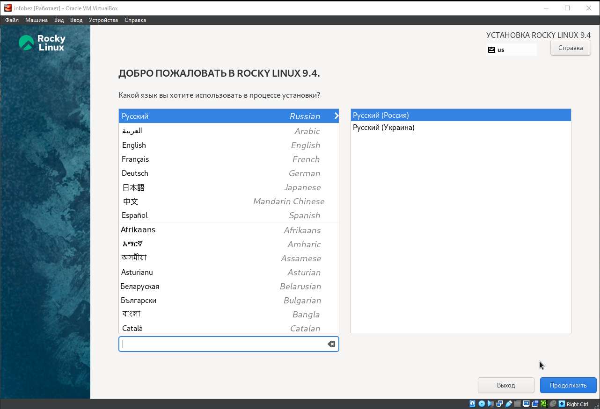
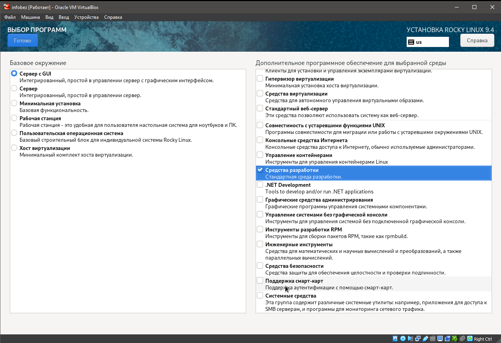
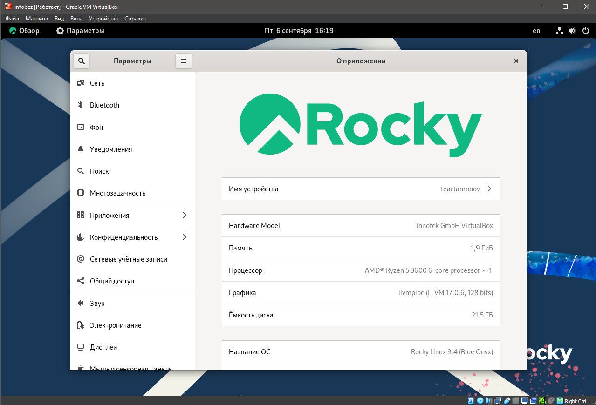
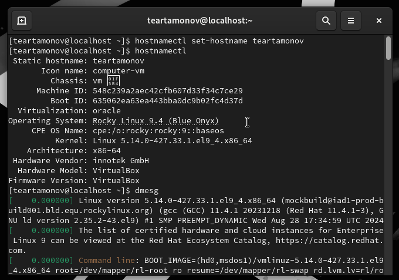
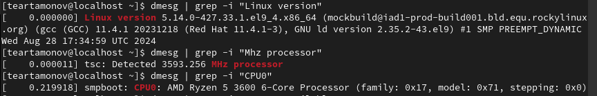
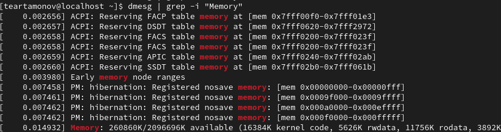
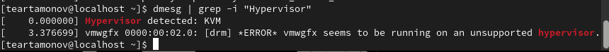
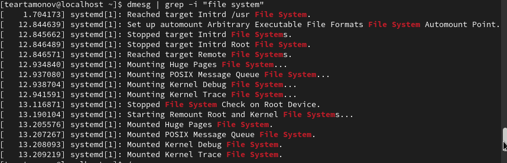

---
## Front matter
lang: ru-RU
title: Лабораторная работа № 1
subtitle: Установка и конфигурация операционной системы на виртуальную машину
author:
  - Артамонов Т. Е.
institute:
  - Российский университет дружбы народов, Москва, Россия
date: 6 сентября 2024

## i18n babel
babel-lang: russian
babel-otherlangs: english

## Formatting pdf
toc: false
toc-title: Содержание
slide_level: 2
aspectratio: 169
section-titles: true
theme: metropolis
header-includes:
 - \metroset{progressbar=frametitle,sectionpage=progressbar,numbering=fraction}
 - '\makeatletter'
 - '\beamer@ignorenonframefalse'
 - '\makeatother'
---

# Информация

## Докладчик

:::::::::::::: {.columns align=center}
::: {.column width="70%"}

  * Артамонов Тимофей Евгеньевич
  * студент группы НКНбд-01-21
  * Российский университет дружбы народов
  * <https://github.com/teartamonov>

:::
::: {.column width="30%"}

:::
::::::::::::::

## Цель работы

Целью данной работы является приобретение практических навыков установки операционной системы на виртуальную машину, настройки минимально необходимых для дальнейшей работы сервисов.

## Техническое обеспечение

Мы будем использовать виртуальную машину VirtualBox от Oracle [@VM:bash] и установим на нее операционную систему Linux, дестрибутив Rocky [@Rocky:bash].

# Выполнение лабораторной работы

## Скачали iso-файл диструбутива Rocky с официального сайта для архитектуры x86_64 и создали новую систему со следующими параметрами (рис. [-@fig:001])

{#fig:001 width=70%}

## Запустили нашу систему и начали установку Rocky Linux 9.4 (рис. [-@fig:002])

{#fig:002 width=70%}

## Выбрали средства разработки в качестве дополнительного ПО, а также отключили kdump, создали пользователя и сделали его администратором. (рис. [-@fig:003])

{#fig:003 width=70%}

## Дождались установки и перезагрузили систему, Rocky успешно установлен. (рис. [-@fig:004])

{#fig:004 width=70%}

## Установим имя хоста в соответствие с правилами именования, а так же проанализируем запуск операционной системы с помощью команды dmesg. (рис. [-@fig:005])

{#fig:005 width=70%}

# Получим информацию о системе, используя команду dmesg | grep для поиска

## Версия ядра и процессор (рис. [-@fig:006])

1. Версия ядра Linux (Linux version) - 5.14.0-427.33.1.el9_4.x86_64.
2. Частота процессора (Detected Mhz processor) - 3593.256 Mhz. 
3. Модель процессора (CPU0) - AMD Ryzen 5 3600 6-Core Processor.
   
{#fig:006 width=70%}

## Память (рис. [-@fig:007])

4. Объем доступной оперативной памяти (Memory available) - 260860K/2096696K.

{#fig:007 width=70%}

## Гипервизор (рис. [-@fig:008])

5. Тип обнаруженного гипервизора (Hypervisor detected) - KVM.

{#fig:008 width=70%}

## Файловая система (рис. [-@fig:009])

6. Тип файловой системы корневого раздела - XFS.

{#fig:009 width=70%}

## Монтирование файловых систем  (рис. [-@fig:010])

7. Последовательность монтирования файловых систем.

{#fig:010 width=70%}

## Ответы на контрольные вопросы

1. Какую информацию содержит учётная запись пользователя? - *Системное имя, id пользователя, id группы, полное имя, домашний каталог, оболочка и пароль*
2. Укажите команды терминала и приведите примеры:
– для получения справки по команде - *help*
– для перемещения по файловой системе - *cd*
– для просмотра содержимого каталога - *ls*
– для определения объёма каталога - *du*
– для создания / удаления каталогов / файлов - *mkdir/ rm -r для директорий, touch/rm для файлов* 
– для задания определённых прав на файл / каталог - *chmod*
– для просмотра истории команд - *history*
3. Что такое файловая система? - *архитектура хранения данных в операционной системе*
Приведите примеры с краткой характеристикой - *NTFS - стандартная файловая система для Windows NT, ExFAT - файловая система предназначенная для Flash-накопителей, ext4 - современная файловая система, стандартная для Linux*
4. Как посмотреть, какие файловые системы подмонтированы в ОС? - *findmnt*
5. Как удалить зависший процесс? - *kill*

## Выводы

Установили Rocky на виртуальную машину и получили практические навыки по установке и настройке операционных систем на виртуальных машинах. 

## Список литературы

1. VirtualBox [Электронный ресурс]. Oracler, 2024. URL: https://www.virtualbox.org/.
2. Rocky Linux [Электронный ресурс]. Red Hat, Inc., 2024. URL: https://rockylinux.org.
