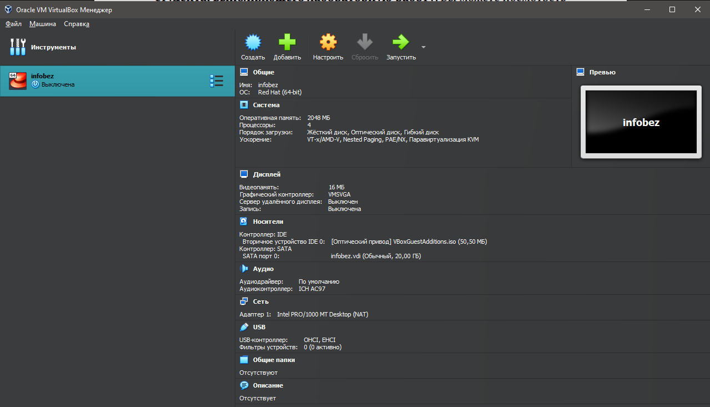
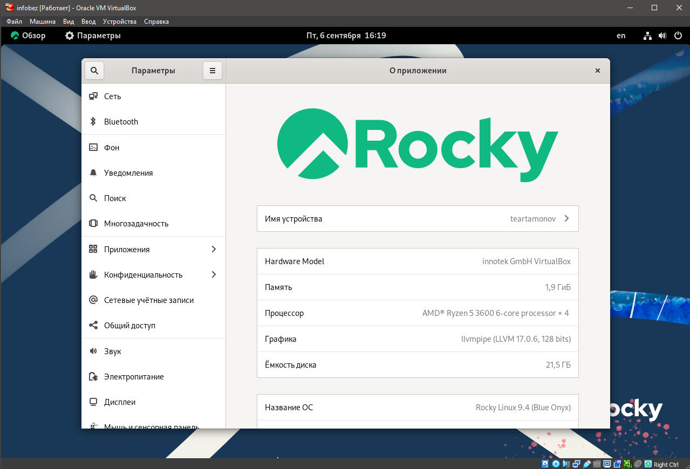
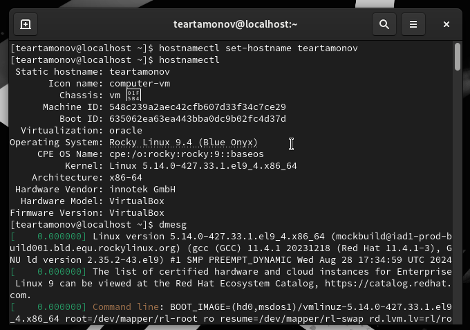
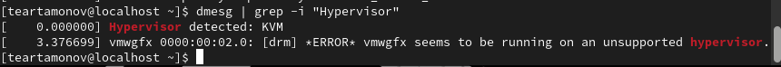
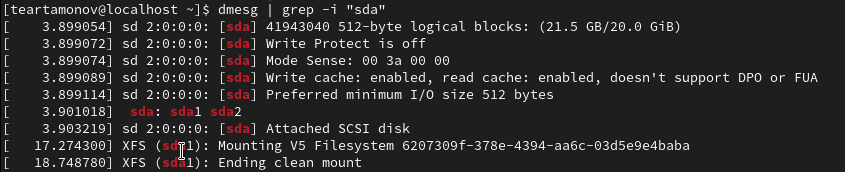

---
## Front matter
title: "Отчёт по лабораторной работе №1"
subtitle: "Установка и конфигурация операционной системы на виртуальную машину"
author: "Артамонов Тимофей Евгеньевич"

## Generic otions
lang: ru-RU
toc-title: "Содержание"

## Bibliography
bibliography: bib/cite.bib
csl: pandoc/csl/gost-r-7-0-5-2008-numeric.csl

## Pdf output format
toc: true # Table of contents
toc-depth: 2
lof: true # List of figures
lot: true # List of tables
fontsize: 12pt
linestretch: 1.5
papersize: a4
documentclass: scrreprt
## I18n polyglossia
polyglossia-lang:
  name: russian
  options:
	- spelling=modern
	- babelshorthands=true
polyglossia-otherlangs:
  name: english
## I18n babel
babel-lang: russian
babel-otherlangs: english
## Fonts
mainfont: PT Serif
romanfont: PT Serif
sansfont: PT Sans
monofont: PT Mono
mainfontoptions: Ligatures=TeX
romanfontoptions: Ligatures=TeX
sansfontoptions: Ligatures=TeX,Scale=MatchLowercase
monofontoptions: Scale=MatchLowercase,Scale=0.9
## Biblatex
biblatex: true
biblio-style: "gost-numeric"
biblatexoptions:
  - parentracker=true
  - backend=biber
  - hyperref=auto
  - language=auto
  - autolang=other*
  - citestyle=gost-numeric
## Pandoc-crossref LaTeX customization
figureTitle: "Рис."
tableTitle: "Таблица"
listingTitle: "Листинг"
lofTitle: "Список иллюстраций"
lotTitle: "Список таблиц"
lolTitle: "Листинги"
## Misc options
indent: true
header-includes:
  - \usepackage{indentfirst}
  - \usepackage{float} # keep figures where there are in the text
  - \floatplacement{figure}{H} # keep figures where there are in the text
---

# Цель работы

Целью данной работы является приобретение практических навыков установки операционной системы на виртуальную машину, настройки минимально необходимых для дальнейшей работы сервисов.

# Техническое обеспечение

Мы будем использовать виртуальную машину VirtualBox от Oracle [@VM:bash] и установим на нее операционную систему Linux, дестрибутив Rocky [@Rocky:bash].

# Выполнение лабораторной работы

Скачали iso-файл диструбутива Rocky с официального сайта для архитектуры x86_64 и создали новую систему со следующими параметрами (рис. [-@fig:001])

{#fig:001 width=70%}

Запустили нашу систему и начали установку Rocky Linux 9.4 (рис. [-@fig:002])

{#fig:002 width=70%}

Выбрали средства разработки в качестве дополнительного ПО, а также отключили kdump, создали пользователя и сделали его администратором. (рис. [-@fig:003])

{#fig:003 width=70%}

Дождались установки и перезагрузили систему, Rocky успешно установлен. (рис. [-@fig:004])

{#fig:004 width=70%}

Установим имя хоста в соответствие с правилами именования, проверим, что все сработало правильно, а так же проанализируем запуск операционной системы с помощью команды dmesg. (рис. [-@fig:005])

{#fig:005 width=70%}

Получим следующую информацию, используя команду dmesg | grep для поиска:

1. Версия ядра Linux (Linux version) - 5.14.0-427.33.1.el9_4.x86_64. (рис. [-@fig:006])
2. Частота процессора (Detected Mhz processor) - 3593.256 Mhz. (рис. [-@fig:006])
3. Модель процессора (CPU0) - AMD Ryzen 5 3600 6-Core Processor. (рис. [-@fig:006])

{#fig:006 width=70%}

4. Объем доступной оперативной памяти (Memory available) - 260860K/2096696K. (рис. [-@fig:007])

{#fig:007 width=70%}

5. Тип обнаруженного гипервизора (Hypervisor detected) - KVM. (рис. [-@fig:008])

{#fig:008 width=70%}

6. Тип файловой системы корневого раздела - XFS. (рис. [-@fig:009])

{#fig:009 width=70%}

7. Последовательность монтирования файловых систем. (рис. [-@fig:010])

{#fig:010 width=70%}

# Ответы на контрольные вопросы

1. Какую информацию содержит учётная запись пользователя? - *Системное имя, id пользователя, id группы, полное имя, домашний каталог, оболочка и пароль*
2. Укажите команды терминала и приведите примеры:
– для получения справки по команде - *help*
– для перемещения по файловой системе - *cd*
– для просмотра содержимого каталога - *ls*
– для определения объёма каталога - *du*
– для создания / удаления каталогов / файлов - *mkdir/ rm -r для директорий, touch/rm для файлов* 
– для задания определённых прав на файл / каталог - *chmod*
– для просмотра истории команд - *history*
3. Что такое файловая система? - *архитектура хранения данных в операционной системе*
Приведите примеры с краткой характеристикой - *NTFS - стандартная файловая система для Windows NT, ExFAT - файловая система предназначенная для Flash-накопителей, ext4 - современная файловая система, стандартная для Linux*
4. Как посмотреть, какие файловые системы подмонтированы в ОС? - *findmnt*
5. Как удалить зависший процесс? - *kill*

# Выводы

Установили Rocky на виртуальную машину и получили практические навыки по установке и настройке операционных систем на виртуальных машинах. 

# Список литературы{.unnumbered}

::: {#refs}
:::
