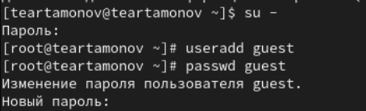
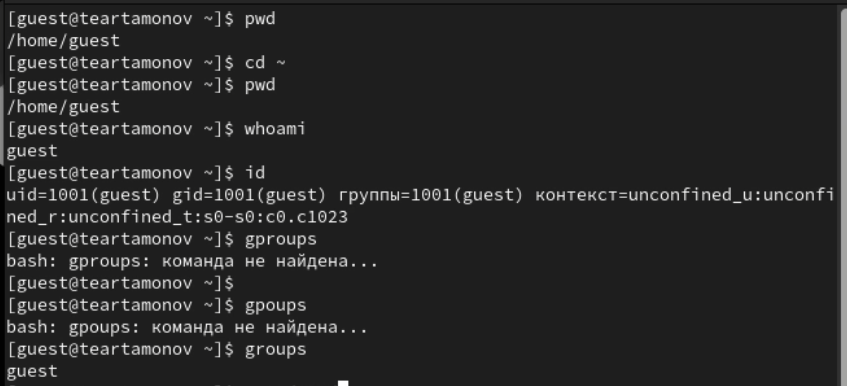
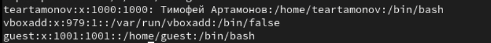
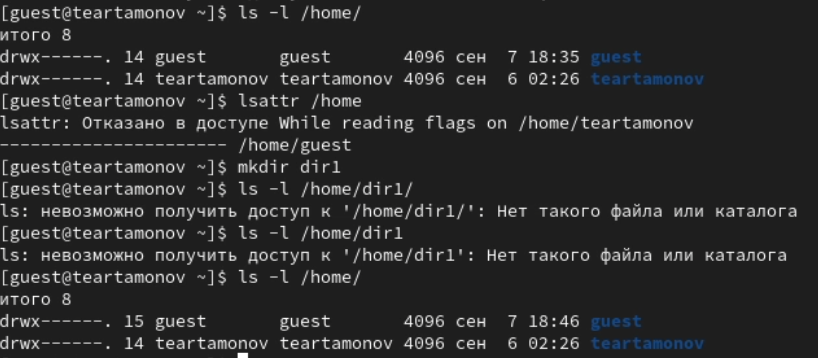
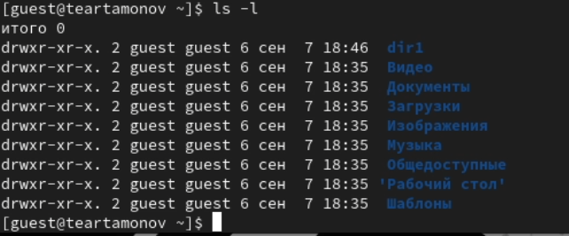
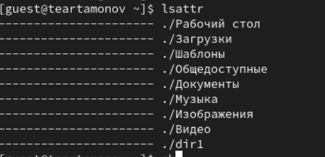
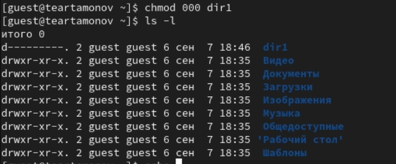
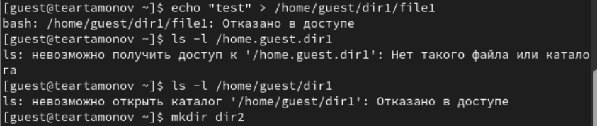

---
## Front matter
lang: ru-RU
title: Лабораторная работа № 2
subtitle: Дискреционное разграничение прав в Linux. Основные атрибуты
author:
  - Артамонов Т. Е.
institute:
  - Российский университет дружбы народов, Москва, Россия
date: 12 сентября 2024

## i18n babel
babel-lang: russian
babel-otherlangs: english

## Formatting pdf
toc: false
toc-title: Содержание
slide_level: 2
aspectratio: 169
section-titles: true
theme: metropolis
header-includes:
 - \metroset{progressbar=frametitle,sectionpage=progressbar,numbering=fraction}
 - '\makeatletter'
 - '\beamer@ignorenonframefalse'
 - '\makeatother'
---

# Информация

## Докладчик

:::::::::::::: {.columns align=center}
::: {.column width="70%"}

  * Артамонов Тимофей Евгеньевич
  * студент группы НКНбд-01-21
  * Российский университет дружбы народов
  * <https://github.com/teartamonov>

:::
::: {.column width="30%"}

:::
::::::::::::::

## Цель работы

Получение практических навыков работы в консоли с атрибутами файлов, закрепление теоретических основ дискреционного разграничения доступа в современных системах с открытым кодом на базе ОС Linux.

## Теоретическое введение

chmod - команда для изменения прав доступа к файлам и каталогам в операционных системах Unix.
Ее синтаксис выглядит как chmod [options] mode[,mode] file1 [file2 ...]
Мы пока ограничимся одним файлом/каталогом и обойдемся без опций.

## Таблица вариантов использования mode

| двоичная | восьмеричная | символьная | права на файл       | права на каталог                   |
|----------|--------------|------------|---------------------|------------------------------------|
| 000	     | 0            | ---    	   | нет                 | нет                                |
| 001	     | 1            | --x    	   | выполнение          | нет                                |
| 010	     | 2            | -w-    	   | запись    	         | нет                                |
| 011	     | 3            | -wx    	   | запись и выполнение | всё, кроме получения имени файлов  |
| 100	     | 4            | r--    	   | чтение	             | чтение имён файлов                 |
| 101	     | 5            | r-x    	   | чтение и выполнение | доступ на чтение файлов/их свойств |
| 110	     | 6            | rw-    	   | чтение и запись     | чтение имён файлов и их создание   |
| 111	     | 7            | rwx    	   | все права	         | все права                          | [@wiki:bash].

# Выполнение лабораторной работы

## Создали нового пользователя и задали ему пароль (рис. [-@fig:001])

{#fig:001 width=70%}

## Вошли в систему от его имени, определили, что находимся в домашней директории, уточнили наше имя, id и группы с помощью разных команд (рис. [-@fig:002])

{#fig:002 width=70%}

## Посмотрели файл /etc/passwd с помощью команды cat. (рис. [-@fig:003])

{#fig:003 width=70%}

## Посмотрели какие права доступа выставлены на домашнюю директорию. (рис. [-@fig:004])

{#fig:004 width=70%}

## Выполнили команду ls -l. (рис. [-@fig:005])

{#fig:005 width=70%}

## Выполнили команду lsattr (рис. [-@fig:006])

{#fig:006 width=70%}

## Поменяем права досутпа на dir1 и проверим, что все сработало. (рис. [-@fig:007])

{#fig:007 width=70%}

## Попробуем выполнить разные команды в отношении dir1. (рис. [-@fig:008])

{#fig:008 width=70%}

## Таблица Минимальные права для совершения операций

| Операция | Минимальные права на директорию | Минимальные права на файл |
|----------|---------------------------------|---------------------------|
|  Создание файла  |  d(300)  | (000)  |
|  Удаление файла  |  d(300)  | (000)  |
|  Чтение файла  |  d(100)  | (400)  |
| Запись в файл  |  d(100)  | (200)  |
| Переименование файла  |  d(300)  | (000)  |
| Создание поддиректории  |  d(300)  | (000)  |
| Удаление поддиректории  |  d(300)  | (000)  |

## Выводы

Получили практические навыки работы в консоли с атрибутами файлов, закрепили теоретические основы дискреционного разграничения доступа в современных системах с открытым кодом на базе ОС Linux.

## Список литературы

1. chmod wiki [Электронный ресурс]. Wikimedia Foundation, Inc., 2024. URL: https://en.wikipedia.org/wiki/Chmod.
