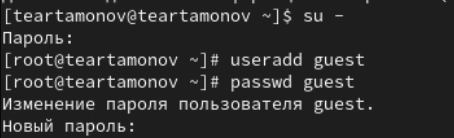
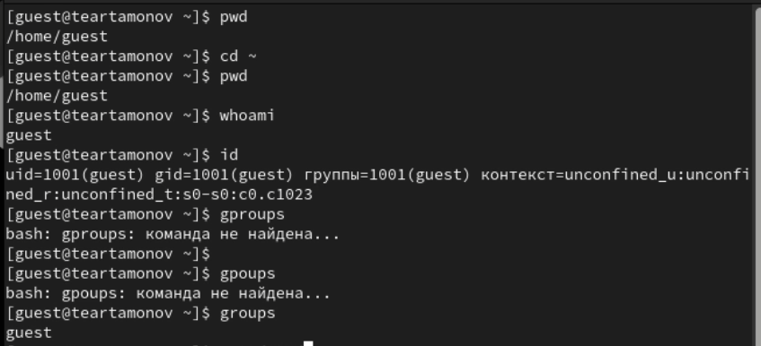
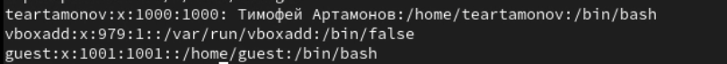
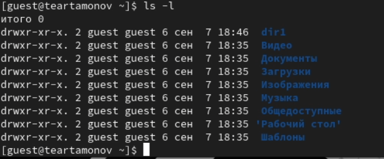
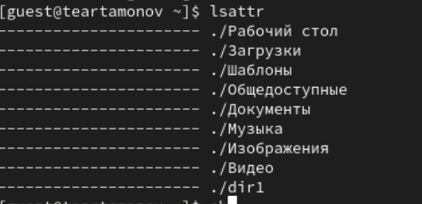
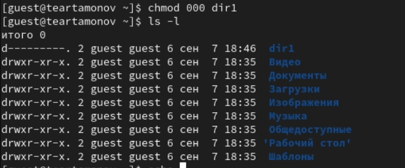
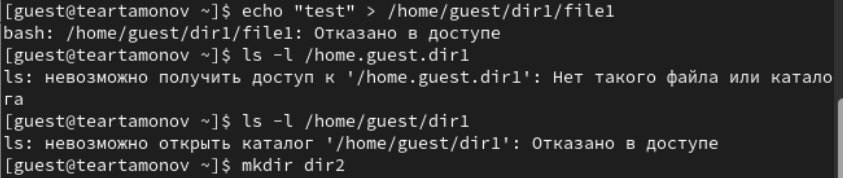

---
## Front matter
title: "Отчёт по лабораторной работе №2"
subtitle: "Дискреционное разграничение прав в Linux. Основные атрибуты"
author: "Артамонов Тимофей Евгеньевич"

## Generic otions
lang: ru-RU
toc-title: "Содержание"

## Bibliography
bibliography: bib/cite.bib
csl: pandoc/csl/gost-r-7-0-5-2008-numeric.csl

## Pdf output format
toc: true # Table of contents
toc-depth: 2
lof: true # List of figures
lot: true # List of tables
fontsize: 12pt
linestretch: 1.5
papersize: a4
documentclass: scrreprt
## I18n polyglossia
polyglossia-lang:
  name: russian
  options:
	- spelling=modern
	- babelshorthands=true
polyglossia-otherlangs:
  name: english
## I18n babel
babel-lang: russian
babel-otherlangs: english
## Fonts
mainfont: PT Serif
romanfont: PT Serif
sansfont: PT Sans
monofont: PT Mono
mainfontoptions: Ligatures=TeX
romanfontoptions: Ligatures=TeX
sansfontoptions: Ligatures=TeX,Scale=MatchLowercase
monofontoptions: Scale=MatchLowercase,Scale=0.9
## Biblatex
biblatex: true
biblio-style: "gost-numeric"
biblatexoptions:
  - parentracker=true
  - backend=biber
  - hyperref=auto
  - language=auto
  - autolang=other*
  - citestyle=gost-numeric
## Pandoc-crossref LaTeX customization
figureTitle: "Рис."
tableTitle: "Таблица"
listingTitle: "Листинг"
lofTitle: "Список иллюстраций"
lotTitle: "Список таблиц"
lolTitle: "Листинги"
## Misc options
indent: true
header-includes:
  - \usepackage{indentfirst}
  - \usepackage{float} # keep figures where there are in the text
  - \floatplacement{figure}{H} # keep figures where there are in the text
---

# Цель работы

Получение практических навыков работы в консоли с атрибутами файлов, закрепление теоретических основ дискреционного разграничения доступа в современных системах с открытым кодом на базе ОС Linux.

# Теоретическое введение

chmod - команда для изменения прав доступа к файлам и каталогам в операционных системах Unix.
Ее синтаксис выглядит как chmod [options] mode[,mode] file1 [file2 ...]
Мы пока ограничимся одним файлом/каталогом и обойдемся без опций.
| двоичная | восьмеричная | символьная | права на файл       | права на каталог                   |
|----------|--------------|------------|---------------------|------------------------------------|
| 000	     | 0            | ---    	   | нет                 | нет                                |
| 001	     | 1            | --x    	   | выполнение          | нет                                |
| 010	     | 2            | -w-    	   | запись    	         | нет                                |
| 011	     | 3            | -wx    	   | запись и выполнение | всё, кроме получения имени файлов  |
| 100	     | 4            | r--    	   | чтение	             | чтение имён файлов                 |
| 101	     | 5            | r-x    	   | чтение и выполнение | доступ на чтение файлов/их свойств |
| 110	     | 6            | rw-    	   | чтение и запись     | чтение имён файлов и их создание   |
| 111	     | 7            | rwx    	   | все права	         | все права                          | [@wiki:bash].

# Выполнение лабораторной работы

Создали нового пользователя и задали ему пароль (рис. [-@fig:001])

{#fig:001 width=70%}

Вошли в систему от его имени, определили, что находимся в домашней директории, уточнили наше имя, id и группы с помощью разных команд (рис. [-@fig:002])

{#fig:002 width=70%}

Посмотрели файл /etc/passwd с помощью команды cat. (рис. [-@fig:003])

{#fig:003 width=70%}

Посмотрели какие права доступа выставлены на домашнюю директорию. (рис. [-@fig:004])

{#fig:004 width=70%}

Выполнили команду ls -l. (рис. [-@fig:005])

{#fig:005 width=70%}

Выполнили команду lsattr (рис. [-@fig:006])

{#fig:006 width=70%}

Поменяем права досутпа на dir1 и проверим, что все сработало. (рис. [-@fig:007])

{#fig:007 width=70%}

Попробуем выполнить разные команды в отношении dir1. (рис. [-@fig:008])

{#fig:008 width=70%}

# Таблица 1

| Права директории | Права файла | Создание файла | Удаление файла | Запись в файл | Чтение файла | Смена директории | Просмотр файлов в директории | Переименование файла | Смена атрибутов файла |
|------------------|-------------|----------------|----------------|---------------|--------------|------------------|------------------------------|----------------------|-----------------------|
|  d(000)  |  (000)  |  -  |  -  |  -  |  -  |  -  |  -  |  -  |  -  |
|  d(100)  |  (000)  |  -  |  -  |  -  |  -  |  +  |  -  |  -  |  +  |
|  d(200)  |  (000)  |  -  |  -  |  -  |  -  |  -  |  -  |  -  |  -  |
|  d(300)  |  (000)  |  +  |  +  |  -  |  -  |  +  |  -  |  +  |  +  |
|  d(400)  |  (000)  |  -  |  -  |  -  |  -  |  -  |  +  |  -  |  -  |
|  d(500)  |  (000)  |  -  |  -  |  -  |  -  |  +  |  +  |  -  |  +  |
|  d(600)  |  (000)  |  -  |  -  |  -  |  -  |  -  |  +  |  -  |  -  |
|  d(700)  |  (000)  |  +  |  +  |  -  |  -  |  +  |  +  |  +  |  +  |
|  d(000)  |  (100)  |  -  |  -  |  -  |  -  |  -  |  -  |  -  |  -  |
|  d(000)  |  (200)  |  -  |  -  |  -  |  -  |  -  |  -  |  -  |  -  |
|  d(000)  |  (300)  |  -  |  -  |  -  |  -  |  -  |  -  |  -  |  -  |
|  d(000)  |  (400)  |  -  |  -  |  -  |  -  |  -  |  -  |  -  |  -  |
|  d(000)  |  (500)  |  -  |  -  |  -  |  -  |  -  |  -  |  -  |  -  |
|  d(000)  |  (600)  |  -  |  -  |  -  |  -  |  -  |  -  |  -  |  -  |
|  d(000)  |  (700)  |  -  |  -  |  -  |  -  |  -  |  -  |  -  |  -  |
|  d(100)  |  (100)  |  -  |  -  |  -  |  -  |  +  |  -  |  -  |  +  |
|  d(100)  |  (200)  |  -  |  -  |  +  |  -  |  +  |  -  |  -  |  +  |
|  d(100)  |  (300)  |  -  |  -  |  +  |  -  |  +  |  -  |  -  |  +  |
|  d(100)  |  (400)  |  -  |  -  |  -  |  +  |  +  |  -  |  -  |  +  |
|  d(100)  |  (500)  |  -  |  -  |  -  |  +  |  +  |  -  |  -  |  +  |
|  d(100)  |  (600)  |  -  |  -  |  +  |  +  |  +  |  -  |  -  |  +  |
|  d(100)  |  (700)  |  -  |  -  |  +  |  +  |  +  |  -  |  -  |  +  |
|  d(200)  |  (100)  |  -  |  -  |  -  |  -  |  -  |  -  |  -  |  -  |
|  d(200)  |  (200)  |  -  |  -  |  -  |  -  |  -  |  -  |  -  |  -  |
|  d(200)  |  (300)  |  -  |  -  |  -  |  -  |  -  |  -  |  -  |  -  |
|  d(200)  |  (400)  |  -  |  -  |  -  |  -  |  -  |  -  |  -  |  -  |
|  d(200)  |  (500)  |  -  |  -  |  -  |  -  |  -  |  -  |  -  |  -  |
|  d(200)  |  (600)  |  -  |  -  |  -  |  -  |  -  |  -  |  -  |  -  |
|  d(200)  |  (700)  |  -  |  -  |  -  |  -  |  -  |  -  |  -  |  -  |
|  d(300)  |  (100)  |  +  |  +  |  -  |  -  |  +  |  -  |  +  |  +  |
|  d(300)  |  (200)  |  +  |  +  |  +  |  -  |  +  |  -  |  +  |  +  |
|  d(300)  |  (300)  |  +  |  +  |  +  |  -  |  +  |  -  |  +  |  +  |
|  d(300)  |  (400)  |  +  |  +  |  -  |  +  |  +  |  -  |  +  |  +  |
|  d(300)  |  (500)  |  +  |  +  |  -  |  +  |  +  |  -  |  +  |  +  |
|  d(300)  |  (600)  |  +  |  +  |  +  |  +  |  +  |  -  |  +  |  +  |
|  d(300)  |  (700)  |  +  |  +  |  +  |  +  |  +  |  -  |  +  |  +  |
|  d(400)  |  (100)  |  -  |  -  |  -  |  -  |  -  |  +  |  -  |  -  |
|  d(400)  |  (200)  |  -  |  -  |  -  |  -  |  -  |  +  |  -  |  -  |
|  d(400)  |  (300)  |  -  |  -  |  -  |  -  |  -  |  +  |  -  |  -  |
|  d(400)  |  (400)  |  -  |  -  |  -  |  -  |  -  |  +  |  -  |  -  |
|  d(400)  |  (500)  |  -  |  -  |  -  |  -  |  -  |  +  |  -  |  -  |
|  d(400)  |  (600)  |  -  |  -  |  -  |  -  |  -  |  +  |  -  |  -  |
|  d(400)  |  (700)  |  -  |  -  |  -  |  -  |  -  |  +  |  -  |  -  |
|  d(500)  |  (100)  |  -  |  -  |  -  |  -  |  +  |  +  |  -  |  +  |
|  d(500)  |  (200)  |  -  |  -  |  +  |  -  |  +  |  +  |  -  |  +  |
|  d(500)  |  (300)  |  -  |  -  |  +  |  -  |  +  |  +  |  -  |  +  |
|  d(500)  |  (400)  |  -  |  -  |  -  |  +  |  +  |  +  |  -  |  +  |
|  d(500)  |  (500)  |  -  |  -  |  -  |  +  |  +  |  +  |  -  |  +  |
|  d(500)  |  (600)  |  -  |  -  |  +  |  +  |  +  |  +  |  -  |  +  |
|  d(500)  |  (700)  |  -  |  -  |  +  |  +  |  +  |  +  |  -  |  +  |
|  d(600)  |  (100)  |  -  |  -  |  -  |  -  |  -  |  +  |  -  |  -  |
|  d(600)  |  (200)  |  -  |  -  |  -  |  -  |  -  |  +  |  -  |  -  |
|  d(600)  |  (300)  |  -  |  -  |  -  |  -  |  -  |  +  |  -  |  -  |
|  d(600)  |  (400)  |  -  |  -  |  -  |  -  |  -  |  +  |  -  |  -  |
|  d(600)  |  (500)  |  -  |  -  |  -  |  -  |  -  |  +  |  -  |  -  |
|  d(600)  |  (600)  |  -  |  -  |  -  |  -  |  -  |  +  |  -  |  -  |
|  d(600)  |  (700)  |  -  |  -  |  -  |  -  |  -  |  +  |  -  |  -  |
|  d(700)  |  (100)  |  +  |  +  |  -  |  -  |  +  |  +  |  +  |  +  |
|  d(700)  |  (200)  |  +  |  +  |  +  |  -  |  +  |  +  |  +  |  +  |
|  d(700)  |  (300)  |  +  |  +  |  +  |  -  |  +  |  +  |  +  |  +  |
|  d(700)  |  (400)  |  +  |  +  |  -  |  +  |  +  |  +  |  +  |  +  |
|  d(700)  |  (500)  |  +  |  +  |  -  |  +  |  +  |  +  |  +  |  +  |
|  d(700)  |  (600)  |  +  |  +  |  +  |  +  |  +  |  +  |  +  |  +  |
|  d(700)  |  (700)  |  +  |  +  |  +  |  +  |  +  |  +  |  +  |  +  |

# Таблица 2

| Операция | Минимальные права на директорию | Минимальные права на файл |
|----------|---------------------------------|---------------------------|
|  Создание файла  |  d(300)  | (000)  |
|  Удаление файла  |  d(300)  | (000)  |
|  Чтение файла  |  d(100)  | (400)  |
| Запись в файл  |  d(100)  | (200)  |
| Переименование файла  |  d(300)  | (000)  |
| Создание поддиректории  |  d(300)  | (000)  |
| Удаление поддиректории  |  d(300)  | (000)  |

# Выводы

Получили практические навыки работы в консоли с атрибутами файлов, закрепили теоретические основы дискреционного разграничения доступа в современных системах с открытым кодом на базе ОС Linux.

# Список литературы{.unnumbered}

::: {#refs}
:::
