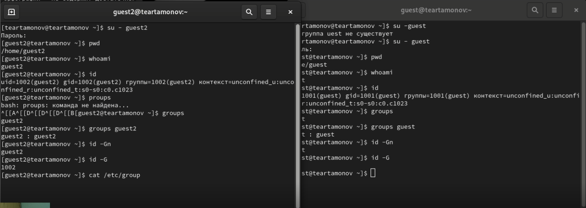
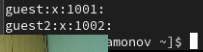
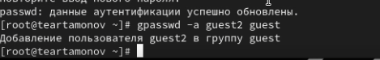
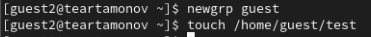

---
## Front matter
lang: ru-RU
title: Лабораторная работа № 3
subtitle: Дискреционное разграничение прав в Linux. Два пользователя
author:
  - Артамонов Т. Е.
institute:
  - Российский университет дружбы народов, Москва, Россия
date: 19 сентября 2024

## i18n babel
babel-lang: russian
babel-otherlangs: english

## Formatting pdf
toc: false
toc-title: Содержание
slide_level: 2
aspectratio: 169
section-titles: true
theme: metropolis
header-includes:
 - \metroset{progressbar=frametitle,sectionpage=progressbar,numbering=fraction}
 - '\makeatletter'
 - '\beamer@ignorenonframefalse'
 - '\makeatother'
---

# Информация

## Докладчик

:::::::::::::: {.columns align=center}
::: {.column width="70%"}

  * Артамонов Тимофей Евгеньевич
  * студент группы НКНбд-01-21
  * Российский университет дружбы народов
  * <https://github.com/teartamonov>

:::
::: {.column width="30%"}

:::
::::::::::::::

## Цель работы

Получение практических навыков работы в консоли с атрибутами файлов для групп пользователей.

# Выполнение лабораторной работы

## Создали двух новых пользователей и определили их директории, имя, uid, gid, группы. (рис. [-@fig:001])

{#fig:001 width=70%}

## Посмотрели файл /etc/passwd с помощью команды cat. (рис. [-@fig:002])

{#fig:002 width=70%}

## Добавили guest2 в группу guest. (рис. [-@fig:003])

{#fig:003 width=70%}

## Зарегистрируем пользователя guest2 в группу guest и начнем заполнение таблицы. (рис. [-@fig:004])

{#fig:004 width=70%}

## Таблица 1

: Минимальные права для совершения операций {#tbl:tbl1}

| Операция | Минимальные права на директорию | Минимальные права на файл |
|----------|---------------------------------|---------------------------|
|  Создание файла  |  d(300)  | (000)  |
|  Удаление файла  |  d(300)  | (000)  |
|  Чтение файла  |  d(100)  | (400)  |
| Запись в файл  |  d(100)  | (200)  |
| Переименование файла  |  d(300)  | (000)  |
| Создание поддиректории  |  d(300)  | (000)  |
| Удаление поддиректории  |  d(300)  | (000)  |

## Выводы

Получили практические навыки работы в консоли с атрибутами файлов для групп пользователей.

## Список литературы

1. chmod wiki [Электронный ресурс]. Wikimedia Foundation, Inc., 2024. URL: https://en.wikipedia.org/wiki/Chmod.
