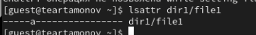
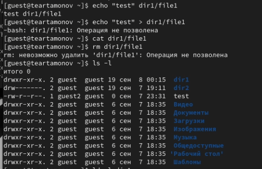
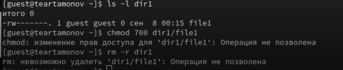
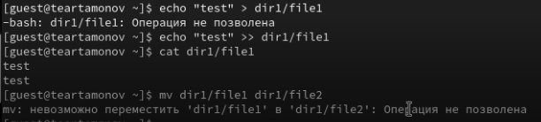
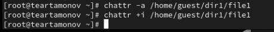
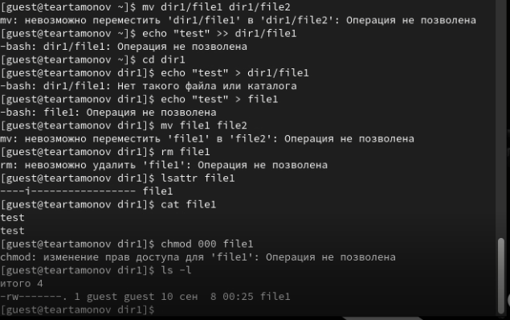

---
## Front matter
lang: ru-RU
title: Лабораторная работа № 4
subtitle: Дискреционное разграничение прав в Linux. Расширенные атрибуты
author:
  - Артамонов Т. Е.
institute:
  - Российский университет дружбы народов, Москва, Россия
date: 27 сентября 2024

## i18n babel
babel-lang: russian
babel-otherlangs: english

## Formatting pdf
toc: false
toc-title: Содержание
slide_level: 2
aspectratio: 169
section-titles: true
theme: metropolis
header-includes:
 - \metroset{progressbar=frametitle,sectionpage=progressbar,numbering=fraction}
 - '\makeatletter'
 - '\beamer@ignorenonframefalse'
 - '\makeatother'
---

# Информация

## Докладчик

:::::::::::::: {.columns align=center}
::: {.column width="70%"}

  * Артамонов Тимофей Евгеньевич
  * студент группы НКНбд-01-21
  * Российский университет дружбы народов
  * <https://github.com/teartamonov>

:::
::: {.column width="30%"}

:::
::::::::::::::

## Цель работы

Получение практических навыков работы в консоли с расширенными атрибутами файлов.

## Теоретическое введение

chattr — команда, изменяющая атрибуты файлов на файловых системах ext2fs, ext3, ext4 и частично на других файловых системах Linux.
Операторы 
- "+" обозначает добавление указанных атрибутов к существующим
- "-" обозначает их снятие
- "=" обозначает установку только этих атрибутов файлам.

Символы "ASacDdijsu" указывают на новые атрибуты файлов.

# Выполнение лабораторной работы

## Попробуем добавить атрибут к файлу от имени записи guest. (рис. [-@fig:001])

{#fig:001 width=70%}

## Посмотрим сработала ли команда. (рис. [-@fig:002])

{#fig:002 width=70%}

## Попробуем различные действия с этим файлом. (рис. [-@fig:003])

{#fig:003 width=70%}

## Пробуем дальше. (рис. [-@fig:004])

{#fig:004 width=70%}

## Пробуем дальше. (рис. [-@fig:005])

{#fig:005 width=70%}

## Теперь снимем атрибут "a" и поставим "i". (рис. [-@fig:006])

{#fig:006 width=70%}

## Так же попробуем выполнить разные дейтсвия с файлом, чтобы понять для чего нужен этот атрибут. (рис. [-@fig:007])

{#fig:007 width=70%}

## Выводы

Получили практических навыков работы в консоли с расширенными атрибутами файлов.

## Список литературы

1. chmod wiki [Электронный ресурс]. Wikimedia Foundation, Inc., 2024. URL: https://en.wikipedia.org/wiki/Chmod.
