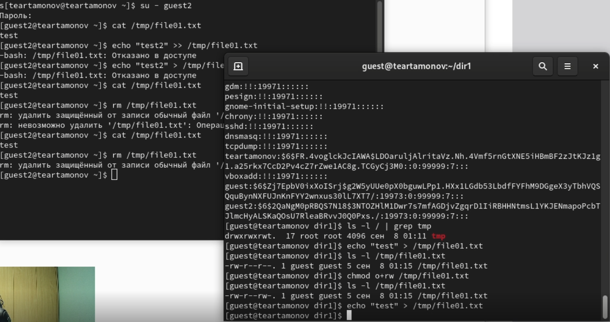

---
## Front matter
lang: ru-RU
title: Лабораторная работа № 5
subtitle: Дискреционное разграничение прав в Linux. Исследование влияния дополнительных атрибутов
author:
  - Артамонов Т. Е.
institute:
  - Российский университет дружбы народов, Москва, Россия
date: 12 сентября 2024

## i18n babel
babel-lang: russian
babel-otherlangs: english

## Formatting pdf
toc: false
toc-title: Содержание
slide_level: 2
aspectratio: 169
section-titles: true
theme: metropolis
header-includes:
 - \metroset{progressbar=frametitle,sectionpage=progressbar,numbering=fraction}
 - '\makeatletter'
 - '\beamer@ignorenonframefalse'
 - '\makeatother'
---

# Информация

## Докладчик

:::::::::::::: {.columns align=center}
::: {.column width="70%"}

  * Артамонов Тимофей Евгеньевич
  * студент группы НКНбд-01-21
  * Российский университет дружбы народов
  * <https://github.com/teartamonov>

:::
::: {.column width="30%"}

:::
::::::::::::::

## Цель работы

Изучение механизмов изменения идентификаторов, применения SetUID и Sticky-битов. Получение практических навыков работы в консоли с дополнительными атрибутами. 
Рассмотрение работы механизма смены идентификатора процессов пользователей, а также влияние бита Sticky на запись и удаление файлов.

## Теоретическое введение

В настоящее время sticky bit используется в основном для каталогов, чтобы защитить в них файлы. Из такого каталога пользователь может удалить только те файлы, владельцем которых он является. 
Примером может служить каталог /tmp, в который запись открыта для всех пользователей, но нежелательно удаление чужих файлов. Установка атрибута производится утилитой chmod.

# Выполнение лабораторной работы

## Создали файл simple.id и записали в него код из лабораторной. (рис. [-@fig:001])

{#fig:001 width=70%}

## Усложним скрипт, добавив вывод real uid и gid. (рис. [-@fig:002])

{#fig:002 width=70%}

## Пропишем chown и chmod. (рис. [-@fig:003])

{#fig:003 width=70%}

## Проделаем то же самое с SetGID-битом. (рис. [-@fig:004])

{#fig:004 width=70%}

## Создадим файл readfile.c как в лабораторной и скомпилируем его. (рис. [-@fig:005])

{#fig:005 width=70%}

## Проверяем. (рис. [-@fig:006])

{#fig:006 width=70%}

## Попробуем прочитать readfile.c с помощью readfile. (рис. [-@fig:007])

{#fig:007 width=70%}

## Попробуем прочитать /etc/shadow с помощью readfile. (рис. [-@fig:008])

{#fig:008 width=70%}

## Найдем директорию tmp, создадим там файл от имени guest и от имени guest2 попробуем выполнит с ним разные действия. (рис. [-@fig:009])

{#fig:009 width=70%}

## Уберем параметр -t и попробуем еще раз. (рис. [-@fig:010])

{#fig:010 width=70%}

## Выводы

Изучили механизмы изменения идентификаторов, применения SetUID и Sticky-битов. Получили практические навыки работы в консоли с дополнительными атрибутами. 
Рассмотрели работу механизма смены идентификатора процессов пользователей, а также влияние бита Sticky на запись и удаление файлов.

## Список литературы

1. Stickybit [Электронный ресурс]. Wikimedia Foundation, Inc., 2024. URL: https://ru.wikipedia.org/wiki/Sticky_bit.