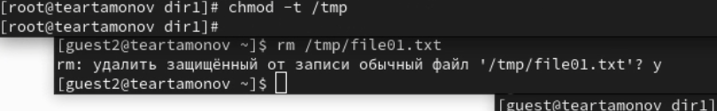

---
## Front matter
title: "Отчёт по лабораторной работе №5"
subtitle: "Дискреционное разграничение прав в Linux. Исследование влияния дополнительных атрибутов"
author: "Артамонов Тимофей Евгеньевич"

## Generic otions
lang: ru-RU
toc-title: "Содержание"

## Bibliography
bibliography: bib/cite.bib
csl: pandoc/csl/gost-r-7-0-5-2008-numeric.csl

## Pdf output format
toc: true # Table of contents
toc-depth: 2
lof: true # List of figures
lot: true # List of tables
fontsize: 12pt
linestretch: 1.5
papersize: a4
documentclass: scrreprt
## I18n polyglossia
polyglossia-lang:
  name: russian
  options:
	- spelling=modern
	- babelshorthands=true
polyglossia-otherlangs:
  name: english
## I18n babel
babel-lang: russian
babel-otherlangs: english
## Fonts
mainfont: PT Serif
romanfont: PT Serif
sansfont: PT Sans
monofont: PT Mono
mainfontoptions: Ligatures=TeX
romanfontoptions: Ligatures=TeX
sansfontoptions: Ligatures=TeX,Scale=MatchLowercase
monofontoptions: Scale=MatchLowercase,Scale=0.9
## Biblatex
biblatex: true
biblio-style: "gost-numeric"
biblatexoptions:
  - parentracker=true
  - backend=biber
  - hyperref=auto
  - language=auto
  - autolang=other*
  - citestyle=gost-numeric
## Pandoc-crossref LaTeX customization
figureTitle: "Рис."
tableTitle: "Таблица"
listingTitle: "Листинг"
lofTitle: "Список иллюстраций"
lotTitle: "Список таблиц"
lolTitle: "Листинги"
## Misc options
indent: true
header-includes:
  - \usepackage{indentfirst}
  - \usepackage{float} # keep figures where there are in the text
  - \floatplacement{figure}{H} # keep figures where there are in the text
---

# Цель работы

Изучение механизмов изменения идентификаторов, применения SetUID и Sticky-битов. Получение практических навыков работы в консоли с дополнительными атрибутами. 
Рассмотрение работы механизма смены идентификатора процессов пользователей, а также влияние бита Sticky на запись и удаление файлов.

# Теоретическое введение

В настоящее время sticky bit используется в основном для каталогов, чтобы защитить в них файлы. Из такого каталога пользователь может удалить только те файлы, владельцем которых он является. 
Примером может служить каталог /tmp, в который запись открыта для всех пользователей, но нежелательно удаление чужих файлов. Установка атрибута производится утилитой chmod. [@wiki:bash]

# Выполнение лабораторной работы

Создали файл simple.id и записали в него код из лабораторной. (рис. [-@fig:001])

{#fig:001 width=70%}

Усложним скрипт, добавив вывод real uid и gid. (рис. [-@fig:002])

{#fig:002 width=70%}

Пропишем chown и chmod. (рис. [-@fig:003])

{#fig:003 width=70%}

Проделаем то же самое с SetGID-битом. (рис. [-@fig:004])

{#fig:004 width=70%}

Создадим файл readfile.c как в лабораторной и скомпилируем его. (рис. [-@fig:005])

{#fig:005 width=70%}

Проверяем. (рис. [-@fig:006])

{#fig:006 width=70%}

Попробуем прочитать readfile.c с помощью readfile. (рис. [-@fig:007])

{#fig:007 width=70%}

Попробуем прочитать /etc/shadow с помощью readfile. (рис. [-@fig:008])

{#fig:008 width=70%}

Найдем директорию tmp, создадим там файл от имени guest и от имени guest2 попробуем выполнит с ним разные действия. (рис. [-@fig:009])

{#fig:009 width=70%}

Уберем параметр -t и попробуем еще раз. (рис. [-@fig:010])

{#fig:010 width=70%}

# Выводы

Изучили механизмы изменения идентификаторов, применения SetUID и Sticky-битов. Получили практические навыки работы в консоли с дополнительными атрибутами. 
Рассмотрели работу механизма смены идентификатора процессов пользователей, а также влияние бита Sticky на запись и удаление файлов.

# Список литературы{.unnumbered}

::: {#refs}
:::
