---
## Front matter
lang: ru-RU
title: Лабораторная работа № 6
subtitle: Мандатное разграничение прав в Linux
author:
  - Артамонов Т. Е.
institute:
  - Российский университет дружбы народов, Москва, Россия
date: 12 октября 2024

## i18n babel
babel-lang: russian
babel-otherlangs: english

## Formatting pdf
toc: false
toc-title: Содержание
slide_level: 2
aspectratio: 169
section-titles: true
theme: metropolis
header-includes:
 - \metroset{progressbar=frametitle,sectionpage=progressbar,numbering=fraction}
 - '\makeatletter'
 - '\beamer@ignorenonframefalse'
 - '\makeatother'
---

# Информация

## Докладчик

:::::::::::::: {.columns align=center}
::: {.column width="70%"}

  * Артамонов Тимофей Евгеньевич
  * студент группы НКНбд-01-21
  * Российский университет дружбы народов
  * <https://github.com/teartamonov>

:::
::: {.column width="30%"}

:::
::::::::::::::

## Цель работы

Развить навыки администрирования ОС Linux. Получить первое практическое знакомство с технологией SELinux1. Проверить работу SELinx на практике совместно с веб-сервером Apache.

## Теоретическое введение

В SELinux права доступа определяются самой системой при помощи специально определённых политик. Политики работают на уровне системных вызовов и применяются самим ядром (но можно реализовать и на уровне приложения). 
SELinux действует после классической модели безопасности Linux: через SELinux нельзя разрешить то, что запрещено через права доступа пользователей или групп. Политики описываются при помощи специального гибкого языка описания правил доступа. 
В большинстве случаев правила SELinux «прозрачны» для приложений, и не требуется никакой их модификации. 
В состав некоторых дистрибутивов входят готовые политики, в которых права могут определяться на основе совпадения типов процесса (субъекта) и файла (объекта) — это основной механизм SELinux. 
Две других формы контроля доступа — доступ на основе ролей и на основе многоуровневой системы безопасности.

# Выполнение лабораторной работы

## Убедимся, что SELinux работает в режиме enforcing политики targeted. (рис. [-@fig:001])

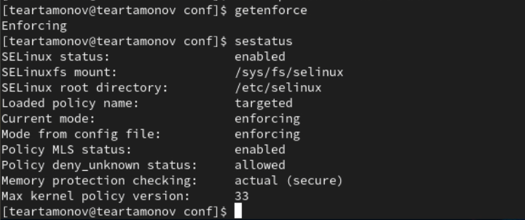{#fig:001 width=70%}

## Обратимся к веб-серверу и убедимся, что он работает. (рис. [-@fig:002])

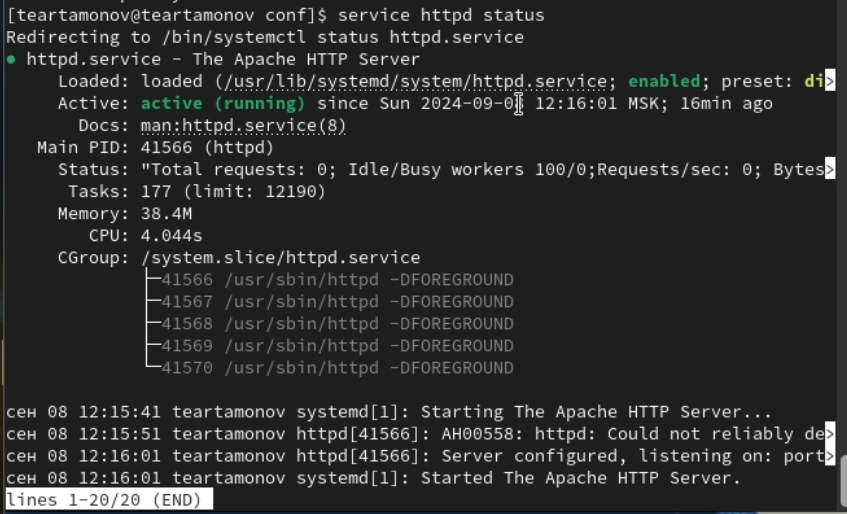{#fig:002 width=70%}

## Найдем apache в списке процессов. (рис. [-@fig:003])

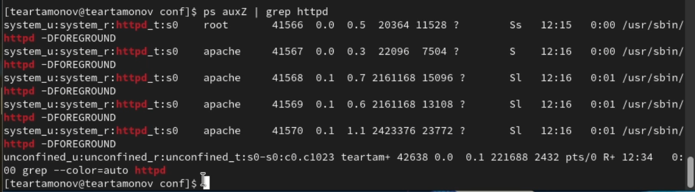{#fig:003 width=70%}

## Посмотрим статистику по политике. (рис. [-@fig:004])

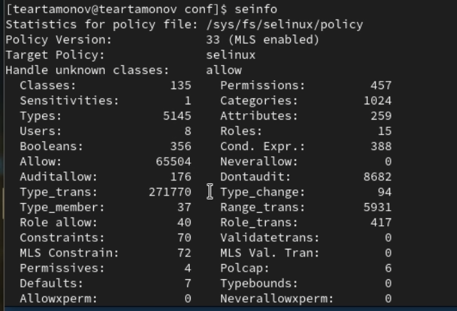{#fig:004 width=70%}

## Определим тип файлов и директорий в /var/www. (рис. [-@fig:005])

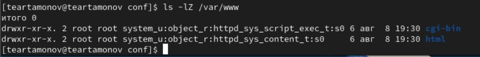{#fig:005 width=70%}

## Посмотрим список пользователей. (рис. [-@fig:006])

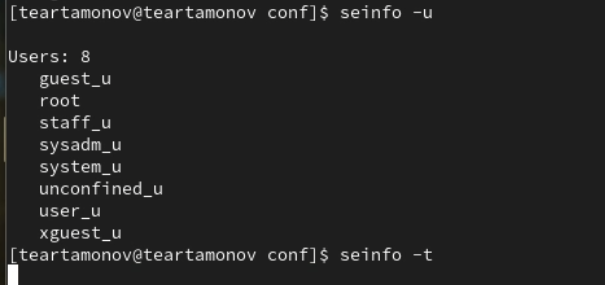{#fig:006 width=70%}

## Создадим от имени root файл в /var/www/html. (рис. [-@fig:007])

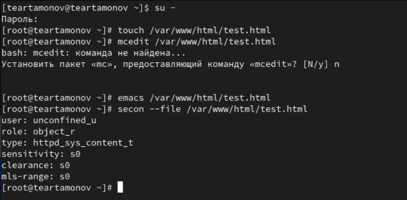{#fig:007 width=70%}

## Попробуем посмотреть файл в браузере. (рис. [-@fig:008])

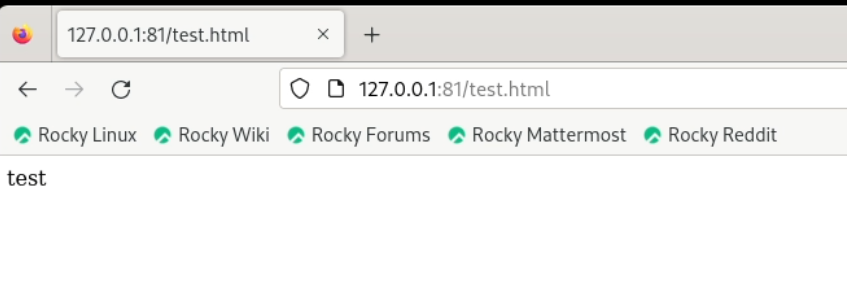{#fig:008 width=70%}

## Изменим контекст файла. (рис. [-@fig:009])

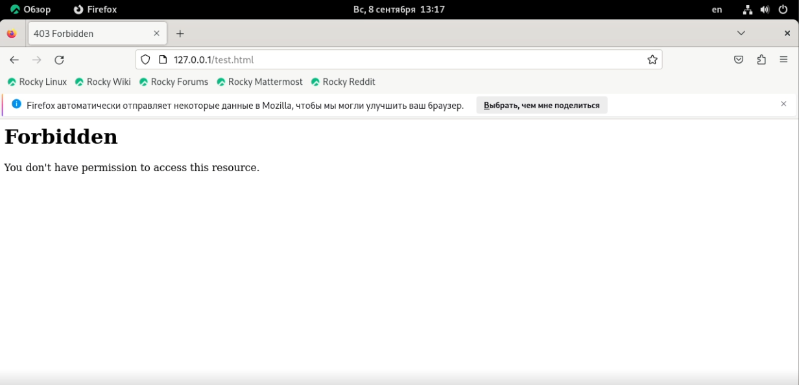{#fig:009 width=70%}

## Добавим на прослушивание порт 81. (рис. [-@fig:010])

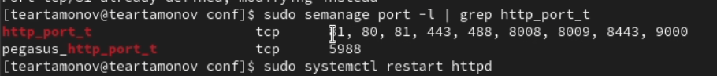{#fig:010 width=70%}

## Вернем все как было. (рис. [-@fig:011])

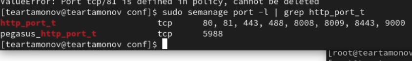{#fig:011 width=70%}

## Выводы

Развили навыки администрирования ОС Linux. Получили первое практическое знакомство с технологией SELinux1. Проверили работу SELinx на практике совместно с веб-сервером Apache.

## Список литературы

1. SELinux [Электронный ресурс]. Wikimedia Foundation, Inc., 2024. URL: https://ru.wikipedia.org/wiki/SELinux.
