---
## Front matter
title: "Отчёт по лабораторной работе №6"
subtitle: "Мандатное разграничение прав в Linux"
author: "Артамонов Тимофей Евгеньевич"

## Generic otions
lang: ru-RU
toc-title: "Содержание"

## Bibliography
bibliography: bib/cite.bib
csl: pandoc/csl/gost-r-7-0-5-2008-numeric.csl

## Pdf output format
toc: true # Table of contents
toc-depth: 2
lof: true # List of figures
lot: true # List of tables
fontsize: 12pt
linestretch: 1.5
papersize: a4
documentclass: scrreprt
## I18n polyglossia
polyglossia-lang:
  name: russian
  options:
	- spelling=modern
	- babelshorthands=true
polyglossia-otherlangs:
  name: english
## I18n babel
babel-lang: russian
babel-otherlangs: english
## Fonts
mainfont: PT Serif
romanfont: PT Serif
sansfont: PT Sans
monofont: PT Mono
mainfontoptions: Ligatures=TeX
romanfontoptions: Ligatures=TeX
sansfontoptions: Ligatures=TeX,Scale=MatchLowercase
monofontoptions: Scale=MatchLowercase,Scale=0.9
## Biblatex
biblatex: true
biblio-style: "gost-numeric"
biblatexoptions:
  - parentracker=true
  - backend=biber
  - hyperref=auto
  - language=auto
  - autolang=other*
  - citestyle=gost-numeric
## Pandoc-crossref LaTeX customization
figureTitle: "Рис."
tableTitle: "Таблица"
listingTitle: "Листинг"
lofTitle: "Список иллюстраций"
lotTitle: "Список таблиц"
lolTitle: "Листинги"
## Misc options
indent: true
header-includes:
  - \usepackage{indentfirst}
  - \usepackage{float} # keep figures where there are in the text
  - \floatplacement{figure}{H} # keep figures where there are in the text
---

# Цель работы

Развить навыки администрирования ОС Linux. Получить первое практическое знакомство с технологией SELinux1. Проверить работу SELinx на практике совместно с веб-сервером Apache.

# Теоретическое введение

В SELinux права доступа определяются самой системой при помощи специально определённых политик. Политики работают на уровне системных вызовов и применяются самим ядром (но можно реализовать и на уровне приложения). 
SELinux действует после классической модели безопасности Linux: через SELinux нельзя разрешить то, что запрещено через права доступа пользователей или групп. Политики описываются при помощи специального гибкого языка описания правил доступа. 
В большинстве случаев правила SELinux «прозрачны» для приложений, и не требуется никакой их модификации. 
В состав некоторых дистрибутивов входят готовые политики, в которых права могут определяться на основе совпадения типов процесса (субъекта) и файла (объекта) — это основной механизм SELinux. 
Две других формы контроля доступа — доступ на основе ролей и на основе многоуровневой системы безопасности. [@wiki:bash]

# Выполнение лабораторной работы

Убедимся, что SELinux работает в режиме enforcing политики targeted. (рис. [-@fig:001])

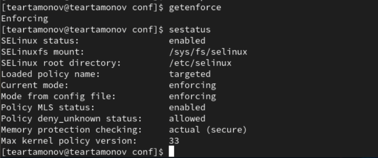{#fig:001 width=70%}

Обратимся к веб-серверу и убедимся, что он работает. (рис. [-@fig:002])

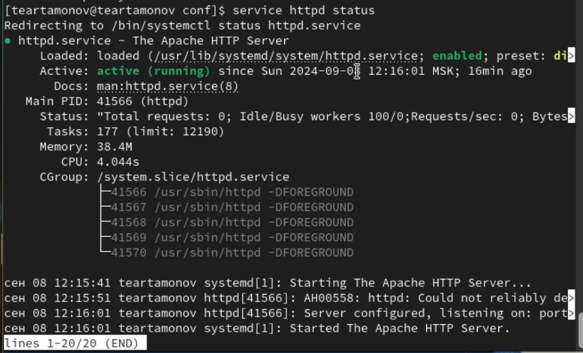{#fig:002 width=70%}

Найдем apache в списке процессов. (рис. [-@fig:003])

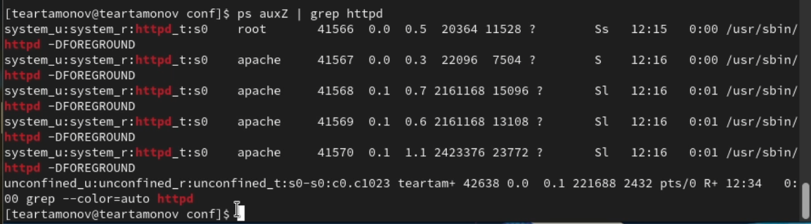{#fig:003 width=70%}

Посмотрим статистику по политике. (рис. [-@fig:004])

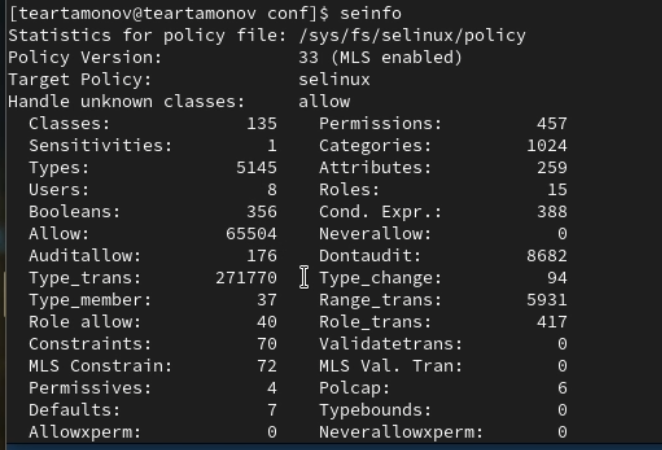{#fig:004 width=70%}

Определим тип файлов и директорий в /var/www. (рис. [-@fig:005])

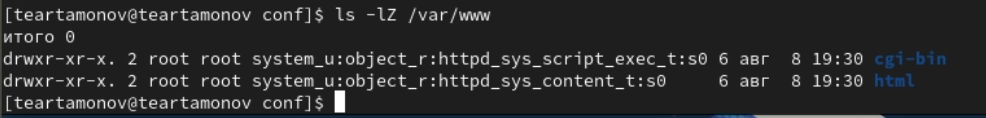{#fig:005 width=70%}

Посмотрим список пользователей. (рис. [-@fig:006])

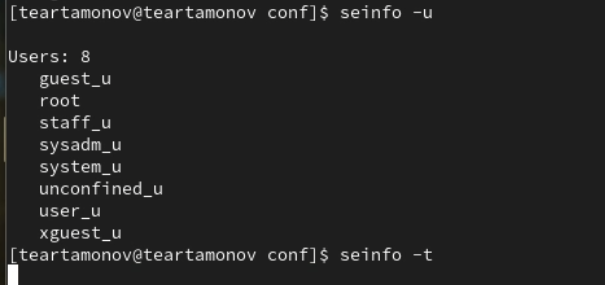{#fig:006 width=70%}

Создадим от имени root файл в /var/www/html. (рис. [-@fig:007])

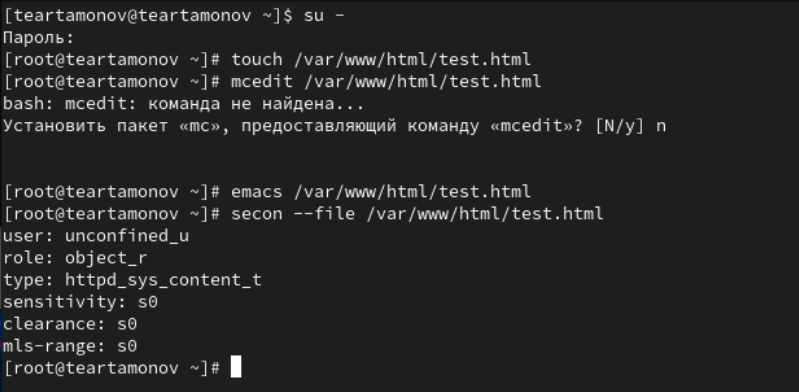{#fig:007 width=70%}

Попробуем посмотреть файл в браузере. (рис. [-@fig:008])

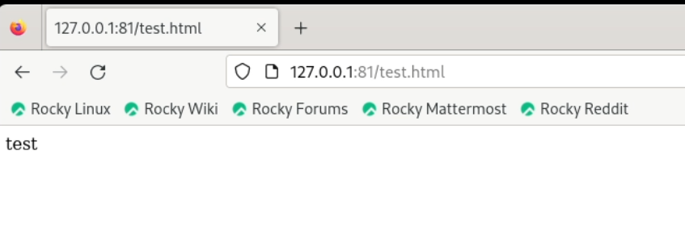{#fig:008 width=70%}

Изменим контекст файла. (рис. [-@fig:009])

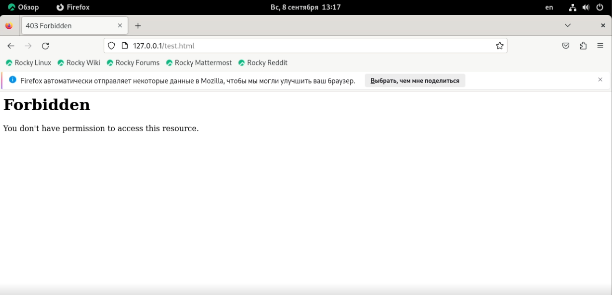{#fig:009 width=70%}

Добавим на прослушивание порт 81. (рис. [-@fig:010])

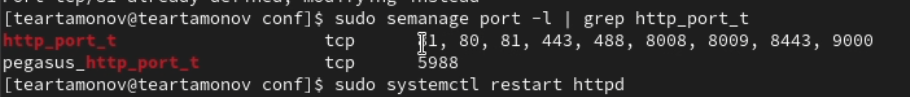{#fig:010 width=70%}

Вернем все как было. (рис. [-@fig:011])

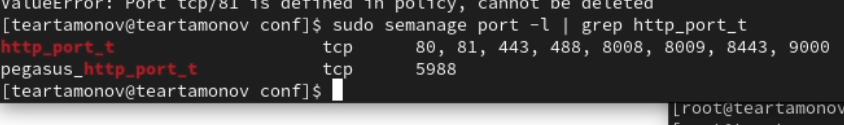{#fig:011 width=70%}

# Выводы

Развили навыки администрирования ОС Linux. Получили первое практическое знакомство с технологией SELinux1. Проверили работу SELinx на практике совместно с веб-сервером Apache.

# Список литературы{.unnumbered}

::: {#refs}
:::