---
## Front matter
lang: ru-RU
title: Индивидуальный проект
subtitle: Этап 2. Установка DVWA
author:
  - Артамонов Т. Е.
institute:
  - Российский университет дружбы народов, Москва, Россия
date: 21 сентября 2024

## i18n babel
babel-lang: russian
babel-otherlangs: english

## Formatting pdf
toc: false
toc-title: Содержание
slide_level: 2
aspectratio: 169
section-titles: true
theme: metropolis
header-includes:
 - \metroset{progressbar=frametitle,sectionpage=progressbar,numbering=fraction}
 - '\makeatletter'
 - '\beamer@ignorenonframefalse'
 - '\makeatother'
---

# Информация

## Докладчик

:::::::::::::: {.columns align=center}
::: {.column width="70%"}

  * Артамонов Тимофей Евгеньевич
  * студент группы НКНбд-01-21
  * Российский университет дружбы народов
  * <https://github.com/teartamonov>

:::
::: {.column width="30%"}

:::
::::::::::::::

## Цель работы

Установить DVWA и сделать приготовления для последующей работы.

## Теоретеческое введение

DVWA (Damn Vulnerable Web Application) - это веб-приложение на PHP/MySQL, которое "чертовски" уязвимо. 
Его основная цель — помочь специалистам по безопасности протестировать свои навыки и инструменты в легальной среде, помочь веб-разработчикам лучше понять процессы обеспечения безопасности веб-приложений, а также помочь студентам и преподавателям изучить вопросы безопасности веб-приложений в контролируемой учебной среде. 

## Теоретеческое введение

Цель DVWA — отработать некоторые из наиболее распространенных веб-уязвимостей с различными уровнями сложности, используя простой и понятный интерфейс. 
Пожалуйста, обратите внимание, что в этом программном обеспечении есть как задокументированные, так и незадокументированные уязвимости. Это сделано намеренно. Вам предлагается попытаться обнаружить как можно больше проблем. 

## Некоторые из уязвимостей веб приложений, который содержит DVWA

Брутфорс: Брутфорс HTTP формы страницы входа - используется для тестирования инструментов по атаке на пароль методом грубой силы и показывает небезопасность слабых паролей.
Исполнение (внедрение) команд: Выполнение команд уровня операционной системы.
Межсайтовая подделка запроса (CSRF): Позволяет «атакующему» изменить пароль администратора приложений.
Внедрение (инклуд) файлов: Позволяет «атакующему» присоединить удалённые/локальные файлы в веб приложение.

## Некоторые из уязвимостей веб приложений, который содержит DVWA

SQL внедрение: Позволяет «атакующему» внедрить SQL выражения в HTTP из поля ввода, DVWA включает слепое и основанное на ошибке SQL внедрение.
Небезопасная выгрузка файлов: Позволяет «атакующему» выгрузить вредоносные файлы на веб сервер.
Межсайтовый скриптинг (XSS): «Атакующий» может внедрить свои скрипты в веб приложение/базу данных. DVWA включает отражённую и хранимую XSS.
Пасхальные яйца: раскрытие полных путей, обход аутентификации и некоторые другие.

## DVWA имеет три уровня безопасности, они меняют уровень безопасности каждого веб приложения в DVWA

Невозможный — этот уровень должен быть безопасным от всех уязвимостей. Он используется для сравнения уязвимого исходного кода с безопасным исходным кодом.
Высокий — это расширение среднего уровня сложности, со смесью более сложных или альтернативных плохих практик в попытке обезопасить код. Уязвимости не позволяют такой простор эксплуатации как на других уровнях.
Средний — этот уровень безопасности предназначен главным образом для того, чтобы дать пользователю пример плохих практик безопасности, где разработчик попытался сделать приложение безопасным, но потерпел неудачу.
Низкий — этот уровень безопасности совершенно уязвим и совсем не имеет защиты. Его предназначение быть примером среди уязвимых веб приложений, примером плохих практик программирования и служить платформой обучения базовым техникам эксплуатации.

# Выполнение лабораторной работы

## Загружаем репозиторий по ссылке. (рис. [-@fig:001])

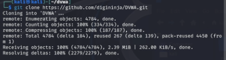{#fig:001 width=70%}

## Запускаем Apache. (рис. [-@fig:002])

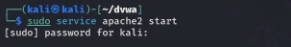{#fig:002 width=70%}

## Открываем веб-страницу Apache. (рис. [-@fig:003])

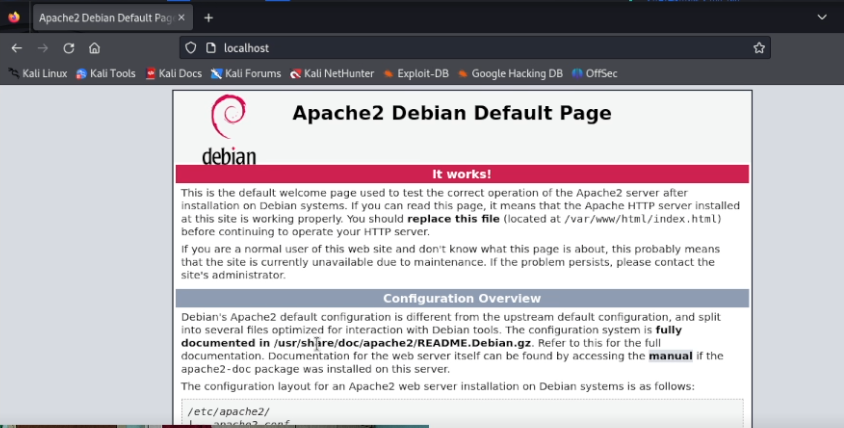{#fig:003 width=70%}

## Копируем файл config.inc.php.dist в config.inc.php. (рис. [-@fig:004])

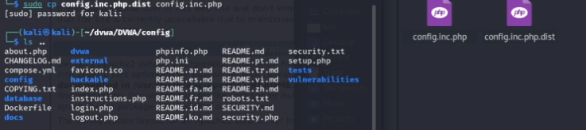{#fig:004 width=70%}

## Посмотрим содержимое файла. (рис. [-@fig:005])

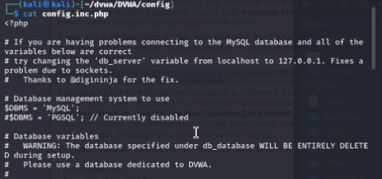{#fig:005 width=70%}

## Откроем стартовую страницу DVWA. (рис. [-@fig:006])

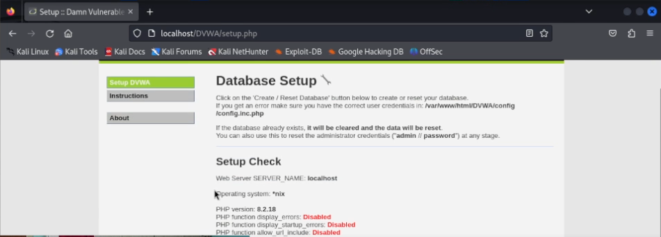{#fig:006 width=70%}

## Запустим mysql. (рис. [-@fig:007])

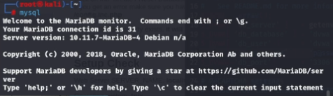{#fig:007 width=70%}

## Создадим базу данных и пользователя, указав данные из файла. (рис. [-@fig:008])

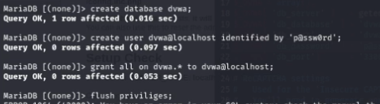{#fig:008 width=70%}

## Запустим MariaDB monitor с созданным пользователем и выберем нашу базу данных. (рис. [-@fig:009])

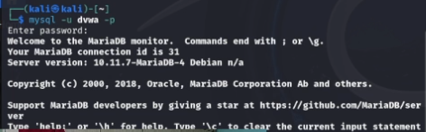{#fig:009 width=70%}

## Нажмем на странице DVWA create/reset database и попадем на страницу с логином. (рис. [-@fig:010])

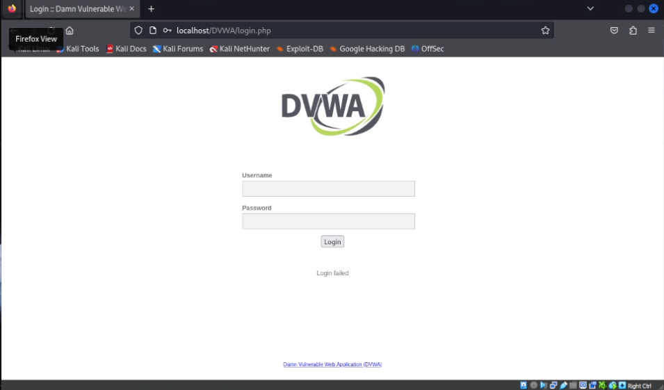{#fig:010 width=70%}

## После входа увидим рабочую область DVWA. (рис. [-@fig:011])

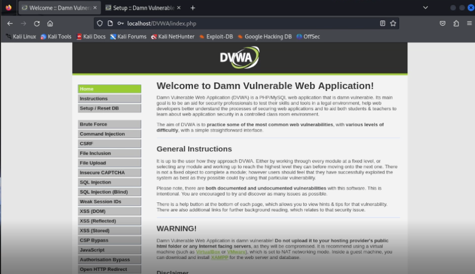{#fig:011 width=70%}

## Выводы

Установили DVWA и сделали приготовления для последубщей работы.

## Список литературы

1. DVWA [Электронный ресурс]. Github, Inc., 2024. URL: https://github.com/digininja/DVWA.
2. Этап 2. Установка DVWA [Электронный ресурс]. RUDN. 2024. URL: https://esystem.rudn.ru/mod/page/view.php?id=1140704
