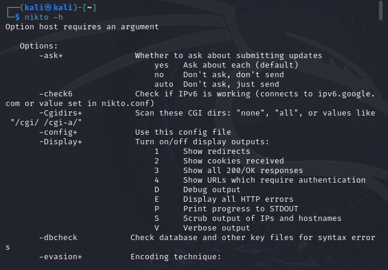
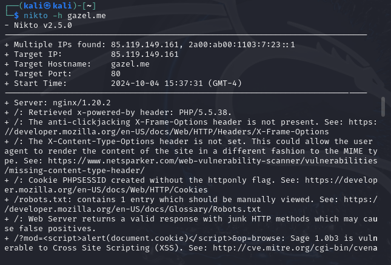
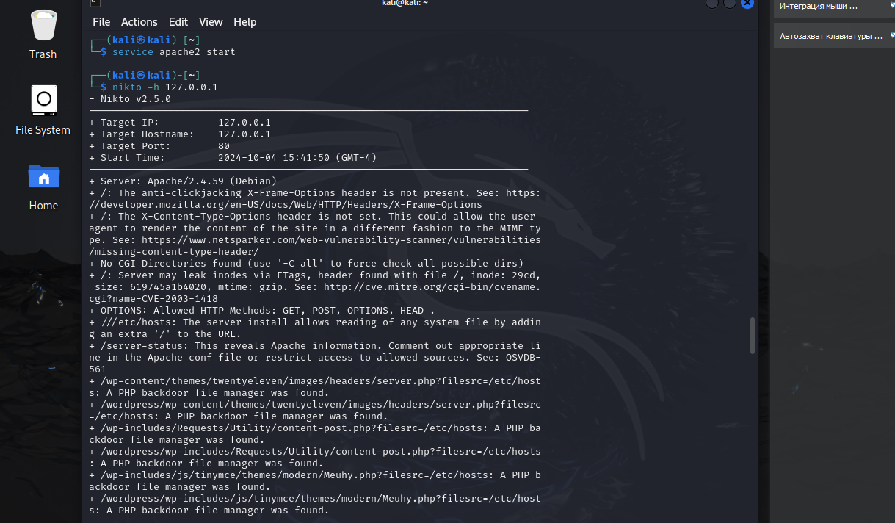
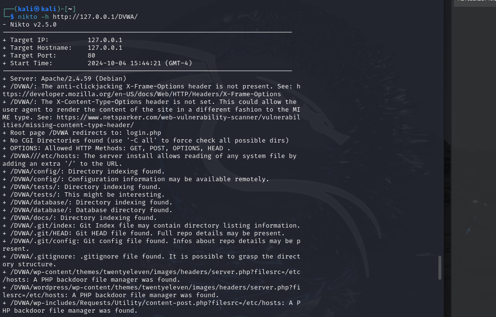

---
## Front matter
lang: ru-RU
title: Индивидуальный проект
subtitle: Этап 4. Использование Nikto
author:
  - Артамонов Т. Е.
institute:
  - Российский университет дружбы народов, Москва, Россия
date: 5 октября 2024

## i18n babel
babel-lang: russian
babel-otherlangs: english

## Formatting pdf
toc: false
toc-title: Содержание
slide_level: 2
aspectratio: 169
section-titles: true
theme: metropolis
header-includes:
 - \metroset{progressbar=frametitle,sectionpage=progressbar,numbering=fraction}
 - '\makeatletter'
 - '\beamer@ignorenonframefalse'
 - '\makeatother'
---

# Информация

## Докладчик

:::::::::::::: {.columns align=center}
::: {.column width="70%"}

  * Артамонов Тимофей Евгеньевич
  * студент группы НКНбд-01-21
  * Российский университет дружбы народов
  * <https://github.com/teartamonov>

:::
::: {.column width="30%"}

:::
::::::::::::::

## Цель работы

Исспользовать Nikto для поиска уязвимостей в системе.

## Теоретеческое введение

Nikto — веб-сканер, проверяющий веб-серверы на самые частые ошибки, возникающие обычно из-за человеческого фактора. 
Проверяет целевой веб-сервер на наличие опасных файлов и исполняемых сценариев, инструментов администрирования базами данных, устаревшего программного обеспечения. [@wiki:bash]

# Выполнение лабораторной работы

## Посмотрим список опций для команды nikto. (рис. [-@fig:001])

{#fig:001 width=70%}

## Запустим nikto для поиска уязвиомстей в системе. (рис. [-@fig:002])

{#fig:002 width=70%}

## Проверим apache2 на уязвимости. (рис. [-@fig:003])

{#fig:003 width=70%}

## Проверим DVWA на уязвимости. (рис. [-@fig:004])

{#fig:004 width=70%}

## Выводы

Использовали nikto для поиска уязвимостей в системе и приложениях.

## Список литературы

1. Nikto [Электронный ресурс].  Wikimedia Foundation, Inc., 2024. URL: https://ru.wikipedia.org/wiki/Nikto.
