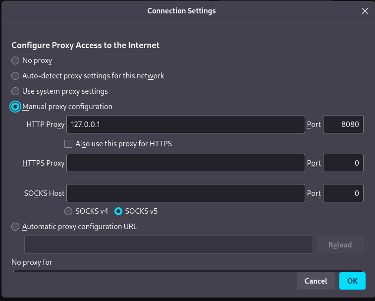
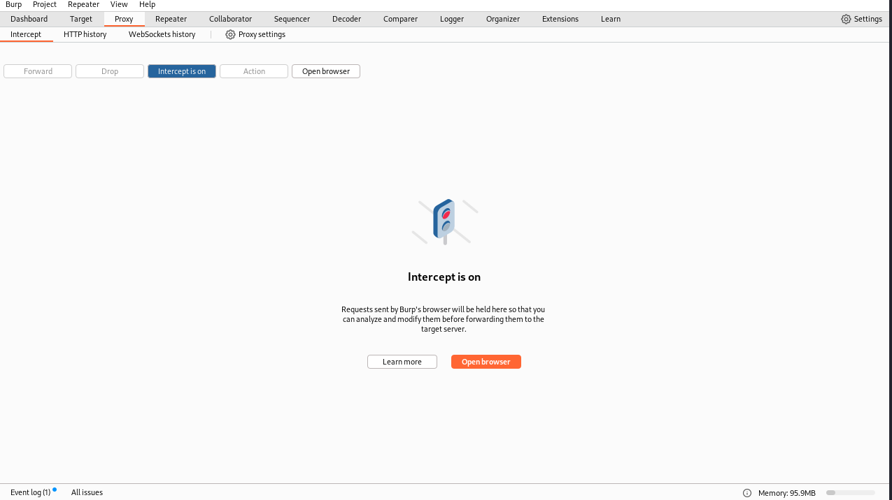
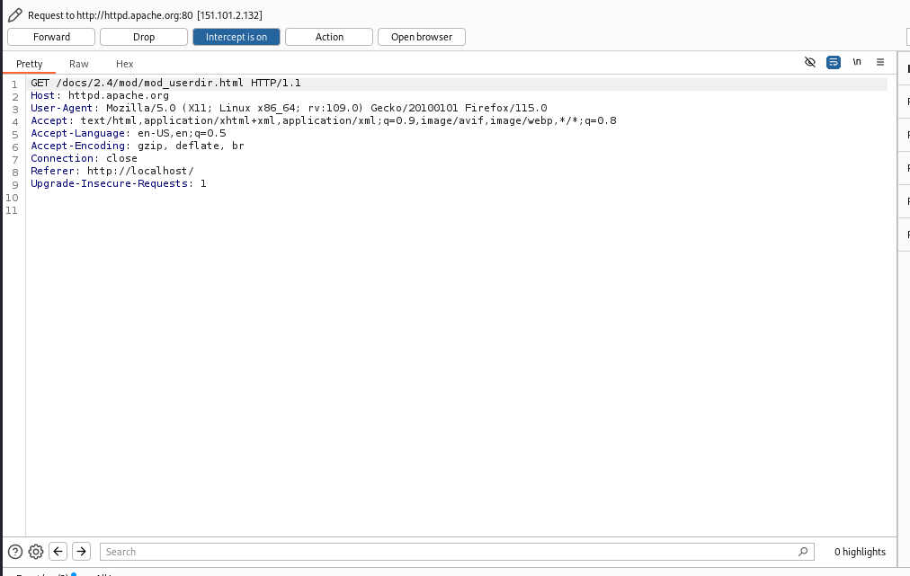
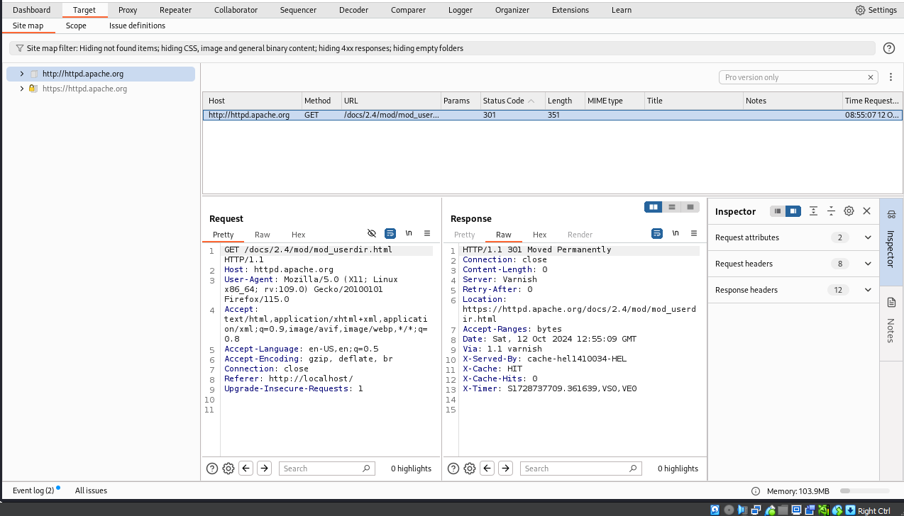
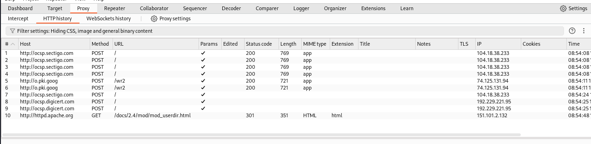

---
## Front matter
lang: ru-RU
title: Индивидуальный проект
subtitle: Этап 5. Использование Burp suite
author:
  - Артамонов Т. Е.
institute:
  - Российский университет дружбы народов, Москва, Россия
date: 12 октября 2024

## i18n babel
babel-lang: russian
babel-otherlangs: english

## Formatting pdf
toc: false
toc-title: Содержание
slide_level: 2
aspectratio: 169
section-titles: true
theme: metropolis
header-includes:
 - \metroset{progressbar=frametitle,sectionpage=progressbar,numbering=fraction}
 - '\makeatletter'
 - '\beamer@ignorenonframefalse'
 - '\makeatother'
---

# Информация

## Докладчик

:::::::::::::: {.columns align=center}
::: {.column width="70%"}

  * Артамонов Тимофей Евгеньевич
  * студент группы НКНбд-01-21
  * Российский университет дружбы народов
  * <https://github.com/teartamonov>

:::
::: {.column width="30%"}

:::
::::::::::::::

## Цель работы

Использовать Burp suite для перехвата запросов и атак.

## Теоретеческое введение

Burp Suite — это проприетарное программное обеспечение для оценки безопасности и тестирования на проникновение веб-приложений.
Примечательные возможности этого пакета включают функции прокси-сканирования веб-страниц (Burp Proxy), регистрировать HTTP-запросы / ответы (Burp Logger и HTTP History), 
захватывать / перехватывать текущие HTTP-запросы (Burp Intercept), и агрегировать отчеты, указывающие на слабые места (Burp Scanner). 
Это программное обеспечение использует встроенную базу данных, содержащую заведомо небезопасные синтаксические шаблоны и ключевые слова для поиска в захваченных HTTP-запросах / ответах.

# Выполнение лабораторной работы

## В настройках браузера зададим прокси. (рис. [-@fig:001])

{#fig:001 width=70%}

## Запустим Burp suite и включим Intercept. (рис. [-@fig:002])

{#fig:002 width=70%}

## Пробуем открыть страницу в браузере. (рис. [-@fig:003])

{#fig:003 width=70%}

## Нажимаем forward и заходим в раздел target. (рис. [-@fig:004])

{#fig:004 width=70%}

## Зайдя обратно в раздел Proxy можем посмотреть историю http запросов. (рис. [-@fig:005])

{#fig:005 width=70%}

# Выводы

Использовали Burp suite для перехвата запросов, атаку провести не вышло тк отсутсвует необходимый раздел.

## Список литературы

1. Burp Suite [Электронный ресурс].  Wikimedia Foundation, Inc., 2024. URL: https://en.wikipedia.org/wiki/Burp_Suite.