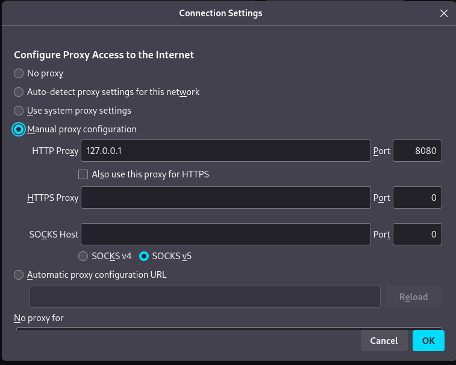
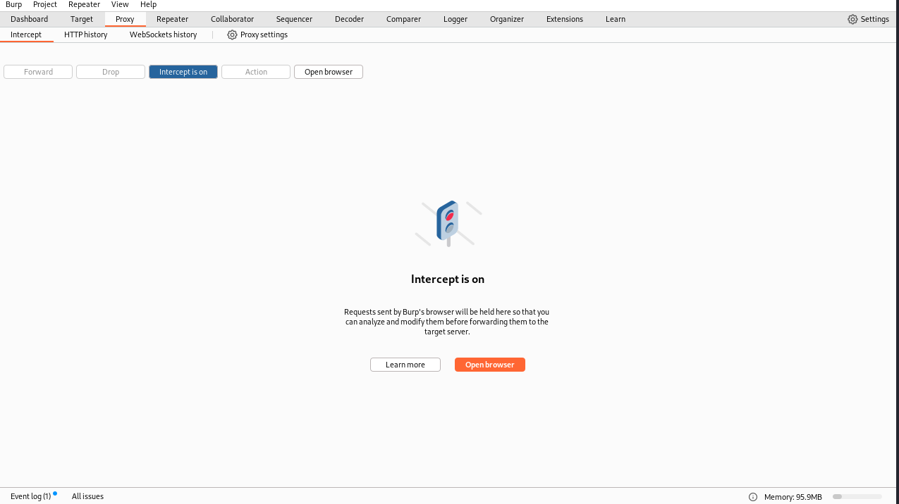
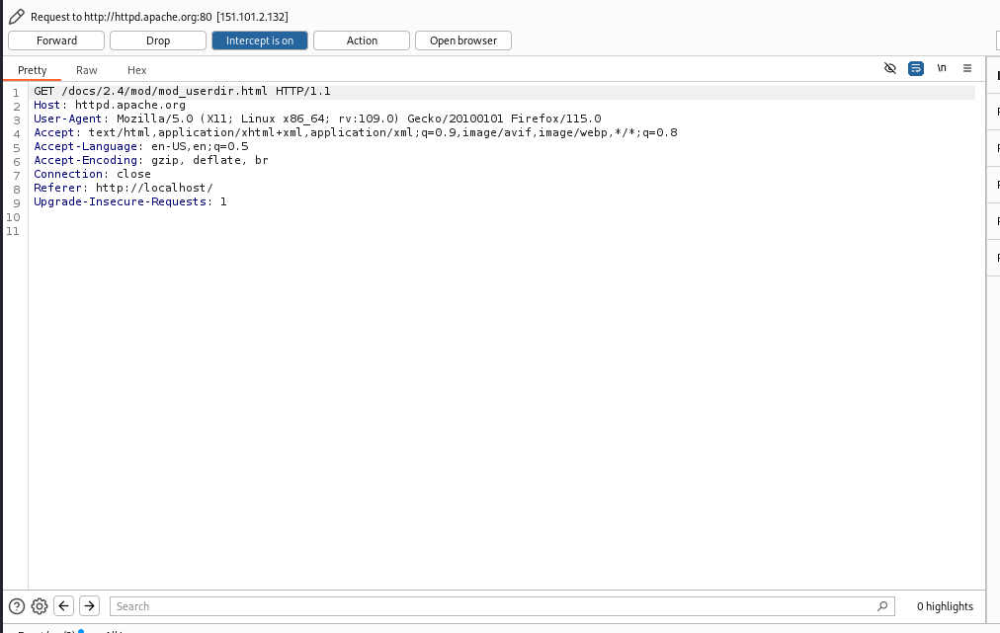
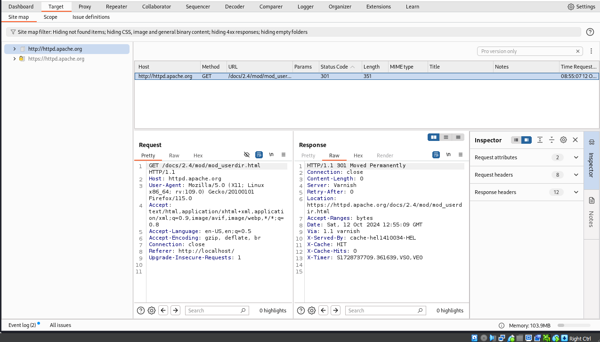
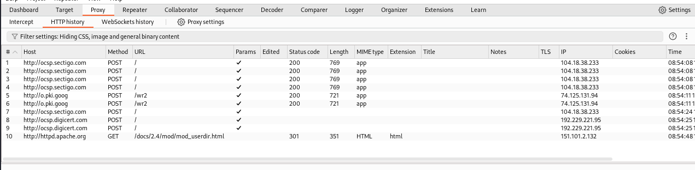

---
## Front matter
title: "Индивидуальный проект"
subtitle: "Этап 5. Использование Burp suite"
author: "Артамонов Тимофей Евгеньевич"

## Generic otions
lang: ru-RU
toc-title: "Содержание"

## Bibliography
bibliography: bib/cite.bib
csl: pandoc/csl/gost-r-7-0-5-2008-numeric.csl

## Pdf output format
toc: true # Table of contents
toc-depth: 2
lof: true # List of figures
lot: true # List of tables
fontsize: 12pt
linestretch: 1.5
papersize: a4
documentclass: scrreprt
## I18n polyglossia
polyglossia-lang:
  name: russian
  options:
	- spelling=modern
	- babelshorthands=true
polyglossia-otherlangs:
  name: english
## I18n babel
babel-lang: russian
babel-otherlangs: english
## Fonts
mainfont: PT Serif
romanfont: PT Serif
sansfont: PT Sans
monofont: PT Mono
mainfontoptions: Ligatures=TeX
romanfontoptions: Ligatures=TeX
sansfontoptions: Ligatures=TeX,Scale=MatchLowercase
monofontoptions: Scale=MatchLowercase,Scale=0.9
## Biblatex
biblatex: true
biblio-style: "gost-numeric"
biblatexoptions:
  - parentracker=true
  - backend=biber
  - hyperref=auto
  - language=auto
  - autolang=other*
  - citestyle=gost-numeric
## Pandoc-crossref LaTeX customization
figureTitle: "Рис."
tableTitle: "Таблица"
listingTitle: "Листинг"
lofTitle: "Список иллюстраций"
lotTitle: "Список таблиц"
lolTitle: "Листинги"
## Misc options
indent: true
header-includes:
  - \usepackage{indentfirst}
  - \usepackage{float} # keep figures where there are in the text
  - \floatplacement{figure}{H} # keep figures where there are in the text
---

# Цель работы

Использовать Burp suite для перехвата запросов и атак.

# Теоретеческое введение

Burp Suite — это проприетарное программное обеспечение для оценки безопасности и тестирования на проникновение веб-приложений.
Примечательные возможности этого пакета включают функции прокси-сканирования веб-страниц (Burp Proxy), регистрировать HTTP-запросы / ответы (Burp Logger и HTTP History), 
захватывать / перехватывать текущие HTTP-запросы (Burp Intercept), и агрегировать отчеты, указывающие на слабые места (Burp Scanner). 
Это программное обеспечение использует встроенную базу данных, содержащую заведомо небезопасные синтаксические шаблоны и ключевые слова для поиска в захваченных HTTP-запросах / ответах. [@wiki:bash]

# Выполнение лабораторной работы

В настройках браузера зададим прокси. (рис. [-@fig:001])

{#fig:001 width=70%}

Запустим Burp suite и включим Intercept. (рис. [-@fig:002])

{#fig:002 width=70%}

Пробуем открыть страницу в браузере. (рис. [-@fig:003])

{#fig:003 width=70%}

Нажимаем forward и заходим в раздел target. (рис. [-@fig:004])

{#fig:004 width=70%}

Зайдя обратно в раздел Proxy можем посмотреть историю http запросов. (рис. [-@fig:005])

{#fig:005 width=70%}

# Выводы

Использовали Burp suite для перехвата запросов, атаку провести не вышло тк отсутсвует необходимый раздел.

# Список литературы{.unnumbered}

::: {#refs}
:::
